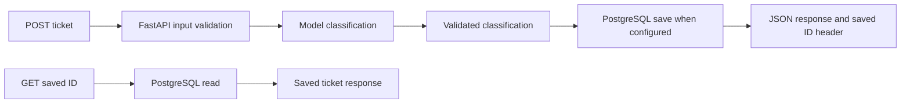

# Support Ticket Classifier — project walkthrough

Project 1 completed: walkthrough, README update, and save/read demo reported done.

## Problem

This service helps a support team classify tickets submitted by customers.
It assigns a category, priority, and sentiment, and produces a short summary
that the team can save and retrieve.

## How it works

The live provider returns `category`, `priority`, `sentiment`, and `summary`.
The offline demo returns a fixed example. The API uses async calls for both the
model and PostgreSQL. Database saving is enabled by `DATABASE_URL`; Compose
configures it for the containerized service.

Saved rows contain the message, classification JSON, ID, and creation time.
A GET request reads the saved result without generating another answer.

Validation checks that the required fields exist and contain allowed values.
It cannot guarantee that the classification is correct: a duplicate-payment
message can be labeled `frustrated`, which is an allowed sentiment, even when
the message expresses no frustration and should be `neutral`. Comparing results
with labeled examples helps catch these mistakes.

## Evidence collected while building

| Check | Recorded result | Scope |
| --- | --- | --- |
| Label evaluation | 6/6 in the reported run | Six development examples; the prompt was tuned using this small set |
| Request timing | 1.31s average, 1.91s slowest | Six-ticket baseline from Day 5, before database saving was added |
| Token usage | 277 input + 29 output = 306 | One duplicate-payment response, not the total evaluation run |
| Automated tests | 18 passing | Input validation, provider handling, and mocked persistence/read behavior |
| Persistence | Saved rows read back after restart | Manually verified against PostgreSQL |
| Schema setup | Migration reapplied; 4 rows preserved | Also applied to a fresh practice database |
| Containers | Both healthy; saved ticket readable after API restart | Local Docker Compose deployment |
| CI | Lint and tests passing | Reported GitHub Actions run |

These checks establish a working learning project. They do not establish accuracy
on a large independent dataset or production performance under load.

## Current limits and next improvement

The service currently has no authentication or request deduplication. If model
classification succeeds and saving fails, model usage has still occurred. Usage
is printed to the server terminal rather than stored as a billing record. The
migration is a manually applied baseline; CI currently uses mocked dependencies.

My next improvement would be listing saved tickets with filters for category
and date. This would let a support team find related tickets without already
knowing each ticket's ID. A paginated `GET /tickets` endpoint would keep each
response manageable as the number of saved tickets grows.

## Run and demonstrate

See the [README](../README.md) for setup, [Day 13](day-13.md) for the container
commands, and [Day 15](day-15.md) for the short save/read demonstration.
